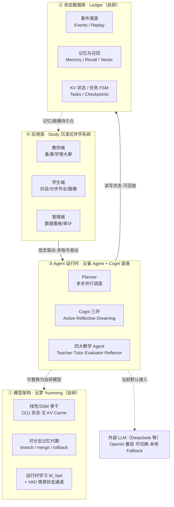

# 沉浸式 AI 智能伴学系统 · PPT 内容与编写指南

> 用途：为「2026 数据要素×大赛」答辩/申报 PPT 提供**内容脚本 + 每页编写建议 + 架构关系图**。
> 主线：把四个自研项目——**云梦（模型）· 云雀 Agent / Cogni（运行时）· Ledger（状态数据库）· Study（伴学应用）**——串成一条**全栈自研**的技术故事，落到《数据库原理》教学场景。
>
> 口径说明：申报书正文保守，只写到「云雀 Agent + Cogni」两层；本 PPT 主动**上探到模型层（云梦）、下沉到数据层（Ledger）**，完整呈现四层自研栈。教学机制（信任分 / 四 Agent / RAG / 分步作业）与申报书原文口径一致，可直接引用。

---

## 0. 一句话总纲（贯穿全场的话术）

> **"别人是在 LLM API 上套壳；我们是自研了从模型架构、Agent 运行时、状态数据库到教学应用的完整四层栈，并让它们为一件事服务——把 AI 从『答案机器』变成『伴学教练』。"**

四个项目不是拼凑，而是**一条依赖链**：

- **云梦** 提供"会记忆、能在推理时学习"的**模型底座能力**；
- **云雀 Agent / Cogni** 把模型组织成**信念驱动、能反思复盘的 Agent 运行时**；
- **Ledger** 为 Agent 提供**可回放、可召回的状态数据库**（记住"发生了什么、学到了什么"）；
- **Study** 在这套底座上实现**教学闭环应用**（信任分、四 Agent、分步作业）。

---

## 1. 四层架构关系图（PPT 核心图，务必做一页大图）

### 1.1 Mermaid 版（支持 Mermaid 的工具直接粘贴：如 draw.io、Typora、飞书文档、Mermaid Live Editor）



### 1.2 ASCII 版（不支持 Mermaid 时，照此手绘/贴图；也可直接截这段图当占位）

```
┌──────────────────────────────────────────────────────────────────┐
│  ④ 应用层  Study · 沉浸式 AI 伴学系统                                  │
│    教师端(备课/学情大屏)   学生端(对话/分步作业/画像)   管理端(看板/审计)  │
└───────────────┬──────────────────────────────────────────────────┘
                │  信念驱动，非指令驱动
                ▼
┌──────────────────────────────────────────────────────────────────┐
│  ③ Agent 运行时  云雀 Agent + Cogni 底座                             │
│    Planner 多步并行调度  │  Cogni 三环(Active/Reflective/Dreaming)   │
│    四大教学 Agent：Teacher · Tutor · Evaluator · Reflector          │
└──────┬────────────────────────────────────┬──────────────────────┘
       │ 读写状态·可回放                        │ 可替换为自研模型
       ▼                                      ▼
┌───────────────────────────┐   ┌──────────────────────────────────┐
│ ② 状态数据库 Ledger(自研)   │   │ ① 模型架构 云梦 Yunmeng(自研)       │
│  事件溯源 / Replay          │   │  线性·SSM 骨干(O(1)状态,无 KV)      │
│  记忆·召回·向量索引          │   │  可分支记忆代数(branch/merge)       │
│  KV 状态 / 任务 FSM         │   │  运行时学习 W_fast + VAD 情感通道    │
└───────────────────────────┘   └──────────────────────────────────┘
                │
                ▼ 记忆/画像持久化回流应用层
   ┌─────────────────────────────────────────┐
   │ 外部 LLM(DeepSeek 等)：OpenAI 兼容·可切换   │
   │ ·当前默认接入·每 Agent 带本地 Fallback     │
   └─────────────────────────────────────────┘
```

**这页的讲稿（30 秒）**：
> "我们的系统不是一层壳，而是自底向上四层自研。最底层云梦是模型架构，解决『模型如何记忆和在推理时学习』；往上云雀 Agent 和 Cogni 是运行时，把模型组织成会反思、会复盘的智能体；Ledger 是我们自研的状态数据库，负责记住『发生了什么、学到了什么』，并支持回放和召回；最上层 Study 才是面向《数据库原理》教学的伴学应用。四层各司其职，又是一条完整依赖链。"

---

## 2. 逐层技术详解（每层做 1 页）

### 2.1 第①层 · 云梦 Yunmeng —— 自研模型架构

> 仓库：`gitcode.com/XiaYuanOwO/Yunmeng`（Apache-2.0）· 团队：云鸢科技

**一句话**：一套探索"可分支记忆 + 运行时学习"的**线性/递归序列模型架构**，为伴学场景提供"会记忆、能在对话中适应"的模型能力底座。

**三个技术亮点（做三个要点框）**：
1. **递归/线性骨干（Gated DeltaNet 风格）**：推理期状态恒定 `O(1)`、**不用 KV Cache**，状态不随上下文变长而膨胀 → 适合长程、连续多轮伴学对话。
2. **可分支记忆代数 BMA**：`branch()` 隔离记忆分支、`merge()` 融合、可回滚 —— 天然契合"每个学生一条独立记忆分支、可安全试错"的教学需求。
3. **运行时学习 W_fast + VAD 情感状态通道**：推理期在线权重更新（off/read/learn/frozen 四模式）、低维情感状态通道 —— 对应"跨会话个性适应 + 情感感知引导"。

**诚实边界（答辩防守用，主动说反而加分）**：云梦当前是**研究型架构代码库**，已跑通递归/分块一致性、有界状态、BMA 分支合并等机制自测；未发布大规模 checkpoint。**当前 Study 生产链路默认接入外部 LLM（DeepSeek），云梦作为自研模型演进路线预留接口**。

**PPT 编写建议**：左半页放"三亮点"卡片，右半页放一张对比小表：

| 能力 | Transformer | 云梦 Yunmeng |
|---|---|---|
| 推理期状态 | O(n) KV Cache | O(1) 递归状态 |
| 可分支记忆对象 | 需外部系统 | 架构原生 BMA |
| 运行时权重适应 | 无 | W_fast（实验） |

### 2.2 第②层 · Ledger —— 自研 Agent 状态数据库

> 仓库：`github.com/LittleXiaYuan/ledger` · 定位：Agent State Core

**一句话**：给长时运行的 AI Agent 用的**轻量状态基础设施**——记录"发生了什么、改了什么、记住了什么、能回放/召回什么"，**只管数据平面，不参与决策**（决策留给上层 Agent 运行时）。

**四个技术亮点**：
1. **事件溯源 + 时间旅行**：所有生命周期变更产生不可变事件，`tasks` 表是物化视图，可 `Replay()` 从事件重建、可从 checkpoint 崩溃恢复 → 对应"学生完整思考轨迹可追溯、过程性评价可回放"。
2. **任务状态机（9 态 FSM）**：created→ready→running→completed/failed/blocked… 每次转移都发事件 → 对应"分步作业逐阶段流转"的可靠状态管理。
3. **记忆与任务感知召回**：Memory + Recall（元数据→图→语义→重排序）+ Vector 向量索引 + Graph 关系图 → 对应"学生画像 + RAG 教案检索"的底层能力。
4. **命名空间 KV**：用一个 SQLite 支撑的状态包替代散落的 JSON 文件（约 25 个 namespace）→ **信任分等状态就存在这里**（README 原文示例：`ldg.KV.Put(ctx, "trust", "scores", ...)`）。

**关键联系点（一定要讲）**：Ledger **就是** 云雀 Agent 的存储核心。yunque-agent 在 `internal/ledger/*` 用它做任务存储、记忆桥、召回桥、KV 迁移 —— 这把②层和③层焊死成一条链。

**PPT 编写建议**：中间放任务状态机的 9 态流转图（README 里有现成 ASCII），两侧列公共 API 面（Tasks / Events / Memory / Recall / Vector / Graph / KV）。

### 2.3 第③层 · 云雀 Agent + Cogni —— 信念驱动的 Agent 运行时（申报书重点）

> 仓库：`github.com/LittleXiaYuan/Tori`（云雀 Agent）· 核心抽象：**Cogni**

**一句话（申报书原话对齐）**：以 **Cogni** 为核心的**声明式、信念驱动**Agent 运行时——"信念驱动，非指令驱动"；单 Go 二进制内嵌前端、90+ 端点控制面。

**三个技术亮点**：
1. **Cogni 声明式单元**：一份 JSON/YAML 声明定义一个 Agent（身份、激活规则、上下文注入、工具面、记忆策略、经验预算），配置像代码一样能被 CI/reload 校验。
2. **Cogni 三环运行时（申报书核心卖点）**：
   - **Active 环** → 处理当前对话任务（"学生现在问什么"）
   - **Reflective 环** → 任务后复盘、标记薄弱点（"发现反复出现的盲区"）
   - **Dreaming 环** → 空闲时回放/探索/技能生长（"整理思维风格与学习趋势，跨会话连续伴学"）
3. **多步并行 Planner + 能力分层 Packs**：Planner 统一调度四大教学 Agent；能力按 Pack 按需扩展（Core / Pack / Lab / Control Plane）。

**关系落点**：③层向下用②层 Ledger 存状态，向下可接①层云梦作模型（当前默认外部 LLM），向上支撑④层 Study 的教学闭环。

**PPT 编写建议**：正中画 Cogni 三环（三个同心/并列环，Active→Reflective→Dreaming），标注每环对应的教学含义。这是与申报书标题《...与 Cogni 底座的深度技术融合》呼应的一页，要做重。

### 2.4 第④层 · Study —— 沉浸式伴学应用（我们一直在做的这个）

> 后端 Go（net/http，:18080）· 教师/学生/管理三端 · SQLite/JSON 双驱动

**一句话**：把上面三层底座落到《数据库原理》课，实现"教→学→评→改"的人机协同教学闭环。

**四大教学 Agent（申报书四组件，与③层 Planner 对应）**：
- **TeacherAgent** 解析教案 → 知识图谱（concepts / difficulties / learning_path）
- **TutorAgent** 苏格拉底式辅导，**只提问不回答**（`enforceQuestionOnly` 保证）
- **EvaluatorAgent** 7 维度过程评价
- **ReflectorAgent** 聚合班级数据 → 教学反思报告
- 每个 Agent 均 **LLM + 本地 Fallback 双路径**，LLM 不可用仍可运行。

---

## 3. 教学机制页（把"技术"翻译成"教育价值"，评委最看重）

### 3.1 信任分驱动的差异化教学（首创，务必单独一页）

> 申报书原话："**信任分本质上不是成绩分，而是系统判断『应当给学生多深帮助』的动态调节器**。"

**计算**：信任分 = 提问质量(45%) + 解释能力(35%) + 思维深度(20%)

**四级分级策略（做成一个漏斗/阶梯图）**：

| 等级 | 分值 | AI 策略 | 教学理念 |
|---|---|---|---|
| locked | 0–29 | 只追问，不给任何提示 | "先证明你在思考" |
| hint | 30–59 | 给方向性提示 | "给你一个线索" |
| partial | 60–79 | 给部分示例 | "你已理解大半" |
| explain | 80–100 | 完整解释 + 迁移任务 | "你已证明理解" |

**一句话讲稿**：学生必须靠自主思考挣到信任分，才能解锁更深的帮助——从机制上遏制"伸手要答案"。

### 3.2 四智能体教学闭环（一页流程环图）

```
教案 →[TeacherAgent 解析]→ 知识图谱
学生提问 →[TutorAgent 苏格拉底引导 + RAG 检索]→ 引导式回答
学生作答 →[EvaluatorAgent 7 维评估]→ 信任分 / 薄弱点
班级数据 →[ReflectorAgent 聚合]→ 教学反思报告 → 教师改进
                    ↑___________ 闭环回流 ___________↓
```

### 3.3 分步作业与过程性评价（一页）

三阶段：**先说想法（理解）→ 再举例子（迁移）→ 最后检查（元认知反思）**；每阶段独立评估，**理解分 ≥ 65 且解释质量 ≥ 55** 才进入下一阶段；全过程记录思考轨迹 → 真正的过程性评价。

### 3.4 RAG 增强的课程适配（可与 3.3 合页）

教师上传教案 → TeacherAgent 建索引 → 学生提问时按**加权评分**检索（标题 60 + 概念 45 + 内容 35 + 词项）→ Top-K 注入 TutorAgent 上下文 → AI 回答始终基于教师实际讲授内容。

---

## 4. 数据要素页（对齐赛事主题"数据要素×"）

**六类数据一次采集、多次使用、持续增值**（申报书口径）：学习轨迹（点击流/提交/修改）、文本语义（提问/答案/解释）、时间沉浸（停顿/耗时）、反馈意图（接受/修订）、教学组织（教案/课程）、审计安全。

**数据流转闭环（"个体—群体—个体"）**：

| 数据要素 | 来源 | 流转 | 价值 |
|---|---|---|---|
| 教案知识图谱 | 教师上传教案 | TeacherAgent 提取 → 持久化 → RAG 匹配 | AI 基于课程内容精准回答 |
| 学生画像 | 每次交互评估 | Evaluator 评分 → 更新记忆 → 下次读取 | 跨会话个性化辅导 |
| 信任分时序 | 每次问答/作业 | 计算信任分 → TrustPolicy → 控制回答深度 | 差异化因材施教 |
| 班级聚合 | Reflector 分析 | 汇总画像 → 共性问题 → 策略建议 | 数据驱动教学决策 |

**这一页把技术栈和主题焊在一起**：这些数据的**采集/回放/召回，正是②层 Ledger 提供的能力**——技术栈直接服务于"数据要素乘数效应"。

---

## 5. 建议的 PPT 页序（18 页版，已绑定截图素材）

> 配图列即 `C:\Users\Administrator\Downloads\教学PPT\` 里的真实产品截图文件名。标「—」的页是纯图形/文字页（用第 1 节架构图或第 3 节机制图，无产品截图）。

| 页 | 标题 | 类型 | 配图（教学PPT 文件夹） |
|---|---|---|---|
| 1 | 封面：沉浸式 AI 智能伴学系统 · 基于云雀 (Yunque) 与 Cogni 底座 | 封面 | `官网.png`（作背景/主视觉） |
| 2 | 痛点：AI 教育三大痛点（认知差异 / 反馈滞后 / 思维惰性） | 痛点 | —（图标+数据） |
| 3 | 我们的答案：从"答案机器"到"伴学教练" + 一句话总纲 | 立意 | `官网.png`（首屏标语「AI 智能伴学，因材施教」） |
| 4 | **★ 四层自研技术栈总架构图** | 核心图 | —（第 1 节 Mermaid/ASCII 架构图） |
| 5 | 第①层 云梦：自研模型架构 | 技术 | —（第 2.1 对比表） |
| 6 | 第②层 Ledger：自研 Agent 状态数据库 | 技术 | —（任务状态机 9 态图） |
| 7 | 第③层 云雀 Agent + Cogni 三环运行时 | 技术(申报书重点) | —（Cogni 三环图） |
| 8 | 第④层 Study：四大教学 Agent 闭环 | 技术 | `教师端，学生学情.png`（对话即操作+学情画像全景） |
| 9 | ★ 信任分驱动的差异化教学（四级阶梯） | 机制/亮点 | `学习流交互2-差答案 反馈.png`（信任分 34、被打回引导） |
| 10 | 苏格拉底引导：好答案通过 vs 差答案打回 | 机制/演示 | 左 `学习流交互1-好答案.png` + 右 `学习流交互2-差答案.png` |
| 11 | 分步作业与过程性评价（4 阶段进度） | 机制 | `学习流-交互1.png`（阶段进度条）+ `任务完成页面-1.png`（通关） |
| 12 | 学生画像：跨会话个性化 | 机制/数据 | `学生画像.png` |
| 13 | 教师端：对话式备课 + 班级画像 | 应用 | `教师端-教师工作台班级画像.png` + `教师工作台-教师端（新建课程）.png` |
| 14 | 教师端：班级报告可生成 PDF | 应用 | `教师工作台班级报告 可生成pdf.png` + `学习端-学习工作台 班级报告教学建议报告.png` |
| 15 | 学生端沉浸式体验：选课环形 + 问 AI | 应用/体验 | `课程选择 环形.png` + `询问AI-学习问询页面.png` |
| 16 | 数据要素：六类数据 × 流转闭环 | 主题对齐 | —（第 4 节流转表） |
| 17 | 应用成效 + 可推广性（Docker/LLM 可切换/全栈自研可控） | 成效/工程 | `任务完成页面-2.png`（成长可视化，可选点缀） |
| 18 | 团队与展望：四项目独立仓库 + 云梦/Ledger 演进路线 | 收尾 | —（四仓库地址 + 演进路线） |

### 截图素材一句话说明（生成 PPT 时给每张图配的图注）

| 文件名 | 一句话图注（可直接用作 PPT 图片标题） |
|---|---|
| `官网.png` | 官网首页：AI 智能伴学，因材施教 |
| `教师端，学生学情.png` | 教师端：对话式操作 + 右侧学生学情画像（信任分/弱点/轨迹） |
| `教师端-教师工作台班级画像.png` | 教师端·班级画像：共性问题 + 均分 + 逐生学情 |
| `教师工作台-教师端（新建课程）.png` | 教师端：用自然语言对话新建课程 |
| `教师工作台班级报告 可生成pdf.png` | 教师端·班级报告：一键生成可导出 PDF |
| `学习端-学习工作台 班级报告教学建议报告.png` | 班级报告：共性问题与教学建议 |
| `学习流-交互1.png` | 学生端·学习流：四阶段分步作业进度 |
| `学习流交互1-好答案.png` | 学生作答（好答案）：达标通过进入下一阶段 |
| `学习流-交互1-差答案.png` | 学生作答（差答案）：即将被打回 |
| `学习流交互2-差答案.png` | 差答案提交 |
| `学习流交互2-差答案 反馈.png` | 信任分 34：被打回并给出苏格拉底式修改建议 |
| `任务完成页面-1.png` | 任务通关页：完成全部阶段 |
| `任务完成页面-2.png` | 成长可视化：信任分/能力雷达 |
| `学生画像.png` | 学生个人画像：信任分趋势 + 知识薄弱点 |
| `询问AI-学习问询页面.png` | 学生端·问 AI：随时提问求引导 |
| `课程选择 环形.png` | 学生端·选课：3D 环形课程选择 |

---

---

## 6. 编写与视觉建议（务实）

- **配色**：底座技术页用冷色（蓝/青）表"硬核底层"，教学机制页用暖色（橙/绿）表"教育温度"，两组呼应总纲"答案机器 vs 伴学教练"。
- **架构图**：第 4 页那张四层图是全场核心，建议用**从下往上"盖楼"动画**逐层浮现（云梦→Ledger→云雀/Cogni→Study），边浮现边讲依赖关系。
- **每页一句话**：每页顶部一句人话结论，底下才是要点/图，避免堆字。
- **佐证自研**：在技术页角标放各项目**独立仓库地址**（云梦 gitcode、Ledger/云雀 github），佐证"真自研、非套壳"。
- **诚实边界**：云梦"研究型架构、生产默认接外部 LLM"这点**主动讲**——评委问"自研模型上线了吗"时你已经答过，反而显专业。
- **术语一致**：全程用「云雀 Agent」「Cogni 三环」「云梦」「Ledger」四个固定名，与仓库/申报书一致，别混用。

---

## 附：一句话记住每个项目（答辩快速回忆）

- **云梦 Yunmeng**：自研**模型架构**——会记忆(BMA)、能在推理时学习(W_fast)、无 KV Cache。
- **Ledger**：自研**Agent 状态数据库**——事件溯源、可回放、记忆召回、KV 状态；是云雀的存储核心。
- **云雀 Agent + Cogni**：信念驱动的**Agent 运行时**——Cogni 三环(Active/Reflective/Dreaming)+ 多步 Planner。
- **Study**：**伴学应用**——信任分 + 四大教学 Agent + 分步作业，落到《数据库原理》。

---

## 7. 一键生成 PPT 的提示词（复制下面整段喂给 AI）

> 用法：把下面 `====` 之间的整段复制给能生成 PPT 的 AI（如 Gamma、讯飞智文、WPS AI、Kimi/文心的 PPT 功能，或任意大模型让它输出 PPTX/Markdown-slides）。
> 图片：AI 通常不能直接读你本地的 `教学PPT` 文件夹。做法二选一——① 用支持"上传图片素材"的工具（Gamma/讯飞智文），按每页标注的文件名把对应截图拖进去；② 生成后在 WPS/PowerPoint 里按第 5 节的「配图」列手动插图。提示词里已用【配图：文件名】标出每页该放哪张，方便对号入座。

```text
====（从这里开始复制）====
请帮我生成一套参赛答辩 PPT，共 18 页，中文，风格：科技感、简洁、专业，深浅得当（底层技术页用冷色调蓝/青，教学机制页用暖色调橙/绿）。每页顶部一句话结论 + 下方要点/图，避免大段文字。项目与赛事信息如下：

【项目全称】沉浸式 AI 智能伴学系统：基于云雀 (Yunque) 与 Cogni 底座的深度技术融合
【赛事】2026 年"数据要素×"大赛山东分赛 · 教育创新赛
【团队】云元深度技术实验室 · 青岛城市学院
【一句话总纲】别人是在 LLM API 上套壳；我们自研了从模型架构、Agent 运行时、状态数据库到教学应用的完整四层栈，只为把 AI 从"答案机器"变成"伴学教练"。

【核心概念·务必术语统一】
- 四层自研技术栈（自底向上）：① 云梦 Yunmeng＝自研模型架构；② Ledger＝自研 Agent 状态数据库；③ 云雀 Agent + Cogni＝信念驱动的 Agent 运行时；④ Study＝沉浸式伴学应用。
- 四层是一条依赖链：云梦提供模型能力 → 云雀/Cogni 组织成会反思的智能体 → Ledger 记住"发生/学到了什么"并支持回放召回 → Study 落到《数据库原理》教学。
- 信任分＝提问质量(45%)+解释能力(35%)+思维深度(20%)，四级：locked(0-29)只追问 / hint(30-59)给方向 / partial(60-79)给部分示例 / explain(80-100)给完整解释+迁移任务。它是"该给学生多深帮助"的动态调节器，不是成绩分。
- 四大教学 Agent：TeacherAgent(解析教案建知识图谱)、TutorAgent(苏格拉底式只提问不回答)、EvaluatorAgent(7维度过程评价)、ReflectorAgent(聚合班级生成反思报告)，由 Planner 统一调度，每个 Agent 有 LLM+本地Fallback 双路径。
- Cogni 三环：Active环(当前对话)、Reflective环(复盘标记薄弱点)、Dreaming环(空闲整理趋势，跨会话连续伴学)。
- 分步作业三阶段：先说想法(理解)→再举例子(迁移)→最后检查(元认知)，理解分≥65且解释质量≥55 才进入下一阶段。

【逐页内容】
第1页 封面：项目全称 + 团队/赛事 + 一句主视觉标语"AI 智能伴学，因材施教"。【配图：官网.png 作背景】
第2页 痛点：AI教育三大痛点——①学生认知差异大难个性化 ②教学反馈滞后错过干预窗口 ③AI助长思维惰性(85%大学生习惯性要答案)。
第3页 我们的答案：从"答案机器"到"伴学教练"，打出一句话总纲。【配图：官网.png】
第4页 ★核心架构图：四层自研技术栈总图(云梦→Ledger→云雀/Cogni→Study + 外部LLM可切换)，建议自下而上"盖楼"式呈现，标注层间依赖。
第5页 ①云梦Yunmeng·自研模型架构：三亮点——递归/线性骨干(O(1)状态、无KV Cache)、可分支记忆代数BMA(branch/merge/rollback)、运行时学习W_fast+VAD情感通道。诚实边界：研究型架构，生产链路当前默认接DeepSeek，云梦为演进路线。
第6页 ②Ledger·自研Agent状态数据库：事件溯源可回放、9态任务状态机、记忆与任务感知召回、命名空间KV(信任分即存于此)。关键：它就是云雀Agent的存储核心。
第7页 ③云雀Agent+Cogni·信念驱动运行时：Cogni声明式单元、Cogni三环(Active/Reflective/Dreaming)、多步并行Planner+能力分层Packs。呼应申报书标题。
第8页 ④Study·四大教学Agent闭环：Teacher/Tutor/Evaluator/Reflector + Planner调度 + 双路径容错。【配图：教师端，学生学情.png】
第9页 ★信任分驱动的差异化教学：四级阶梯图(locked→hint→partial→explain)，讲"靠自主思考挣信任分才解锁更深帮助"。【配图：学习流交互2-差答案 反馈.png，画面里信任分34、被打回引导】
第10页 苏格拉底引导对比：好答案通过 vs 差答案被打回。【左图：学习流交互1-好答案.png；右图：学习流交互2-差答案.png】
第11页 分步作业与过程性评价：四阶段进度 + 通关。【配图：学习流-交互1.png + 任务完成页面-1.png】
第12页 学生画像·跨会话个性化：信任分趋势+知识薄弱点+思维风格。【配图：学生画像.png】
第13页 教师端·对话式备课+班级画像。【配图：教师端-教师工作台班级画像.png + 教师工作台-教师端（新建课程）.png】
第14页 教师端·班级报告可生成PDF：共性问题+教学建议。【配图：教师工作台班级报告 可生成pdf.png + 学习端-学习工作台 班级报告教学建议报告.png】
第15页 学生端沉浸式体验：3D环形选课 + 问AI。【配图：课程选择 环形.png + 询问AI-学习问询页面.png】
第16页 数据要素×主题对齐：六类数据(学习轨迹/文本语义/时间沉浸/反馈意图/教学组织/审计安全)一次采集多次使用持续增值；个体—群体—个体流转闭环；这些数据的采集/回放/召回正是Ledger提供的能力。
第17页 应用成效+可推广性：对学生/教师/管理三方价值；秒级反馈vs传统≥3天；Docker一键部署、LLM可配置切换(OpenAI兼容不绑定供应商)、全栈自研可控；服务可用性≥99.5%。【配图：任务完成页面-2.png 可选】
第18页 团队与展望：四项目均有独立自研仓库(云梦 gitcode/XiaYuanOwO/Yunmeng、Ledger github/LittleXiaYuan/ledger、云雀Agent github/LittleXiaYuan/Tori)；云梦模型与Ledger作为下一代底座持续演进。收尾升华：从套壳到全栈自研，让AI真正成为伴学教练。

请输出结构清晰的 PPT（每页含标题、要点、备注讲稿）。
====（复制到这里结束）====
```

### 提示词使用小贴士

- **要真图片进 PPT**：优先用 **讯飞智文 / Gamma / WPS AI** 这类支持上传素材的工具，生成后按每页【配图：xxx.png】把 `教学PPT` 文件夹里对应截图拖进去。
- **只要文字骨架**：把提示词喂给任意大模型，它会输出 18 页的标题+要点+讲稿，你再在 PowerPoint/WPS 里套模板、插图。
- **架构图**：第 4 页那张四层图，可把本文件第 1.1 节的 Mermaid 代码贴到 mermaid.live 导出 PNG，或让 AI 按第 1.2 节 ASCII 结构重画一张。
- **想更省事**：告诉我"生成 pptx 骨架"，我可以用 python-pptx 直接产出一个已排好 18 页、填好文字、预留图片位的 `.pptx` 文件给你，你只需插图美化。
